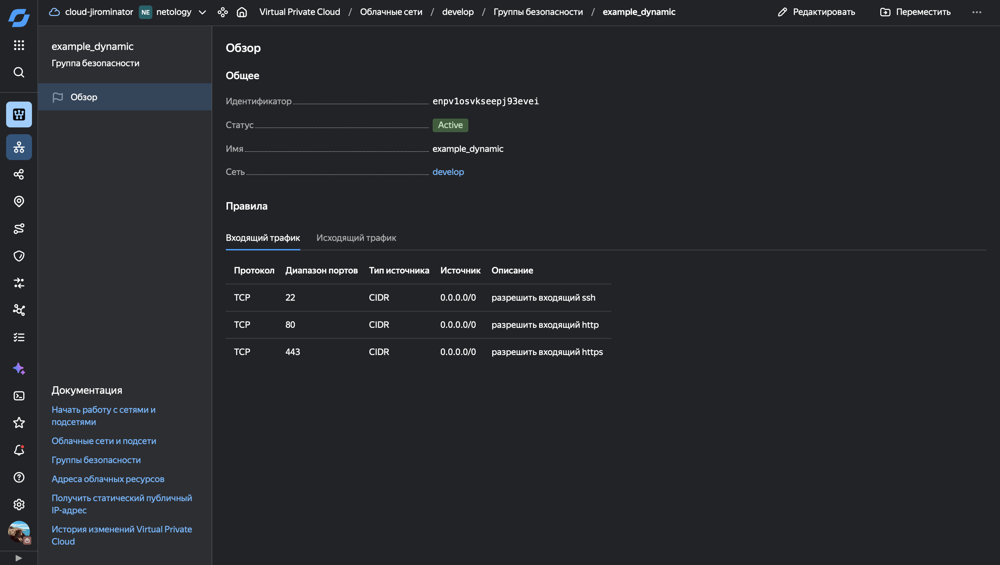
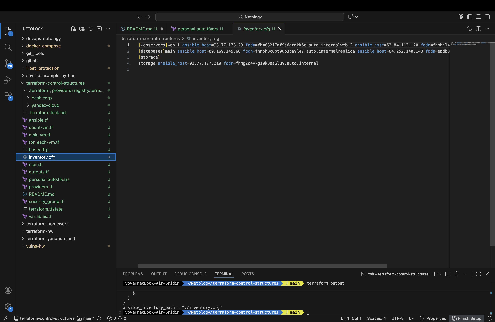

# Домашнее задание к занятию «Управляющие конструкции в коде Terraform»

## Выполнил: Гридин Владимир

---

## Задание 1: Группа безопасности

Создана динамическая группа безопасности с использованием `dynamic` блоков для ingress и egress правил.

**Скриншот входящих правил в ЛК Yandex Cloud:**


---

## Задание 2: Count и For Each

### count-vm.tf
- Созданы 2 одинаковые ВМ: `web-1` и `web-2`
- Использован мета-аргумент `count = 2`
- Имена формируются как `web-${count.index + 1}` (не web-0/web-1)
- Подключена группа безопасности через `security_group_ids`

### for_each-vm.tf
- Созданы 2 разные ВМ БД: `main` и `replica`
- Использован мета-аргумент `for_each` с переменной `each_vm`
- Разные параметры: CPU, RAM, disk_volume
- ВМ web создаются после ВМ БД через `depends_on`

---

## Задание 3: Диски и Dynamic

### disk_vm.tf
- Создано 3 диска по 1 Гб с помощью `count = 3`
- Создана ВМ `storage` (без count/for_each)
- Использован `dynamic "secondary_disk"` с `for_each` для подключения 3 дисков

---

## Задание 4: Ansible Inventory

### hosts.tftpl
Шаблон inventory файла с 3 группами:
- `[webservers]` — динамический список из count ВМ
- `[databases]` — динамический список из for_each ВМ
- `[storage]` — одиночная ВМ

### ansible.tf
- Использована функция `templatefile()`
- Передаются переменные с ВМ из заданий 2.1, 2.2 и 3.2
- Содержит `fqdn` каждой ВМ

**Скриншот получившегося inventory.cfg:**


---

## Структура проекта
.
├── .gitignore
├── .terraformrc
├── ansible.tf
├── count-vm.tf
├── disk_vm.tf
├── for_each-vm.tf
├── hosts.tftpl
├── main.tf
├── outputs.tf
├── providers.tf
├── security_group.tf
├── variables.tf
└── README.md

---

## Команды для развертывания

```bash
terraform init
terraform plan
terraform apply
terraform output
cat inventory.cfg
```

Удаление ресурсов

```bash
terraform destroy
```

---

## Итоговая структура и команды

```bash
# Проверка всех файлов
ls -la

# Инициализация
terraform init

# Планирование
terraform plan

# Применение
terraform apply

# Проверка outputs
terraform output

# Просмотр inventory
cat inventory.cfg

# Удаление
terraform destroy
```